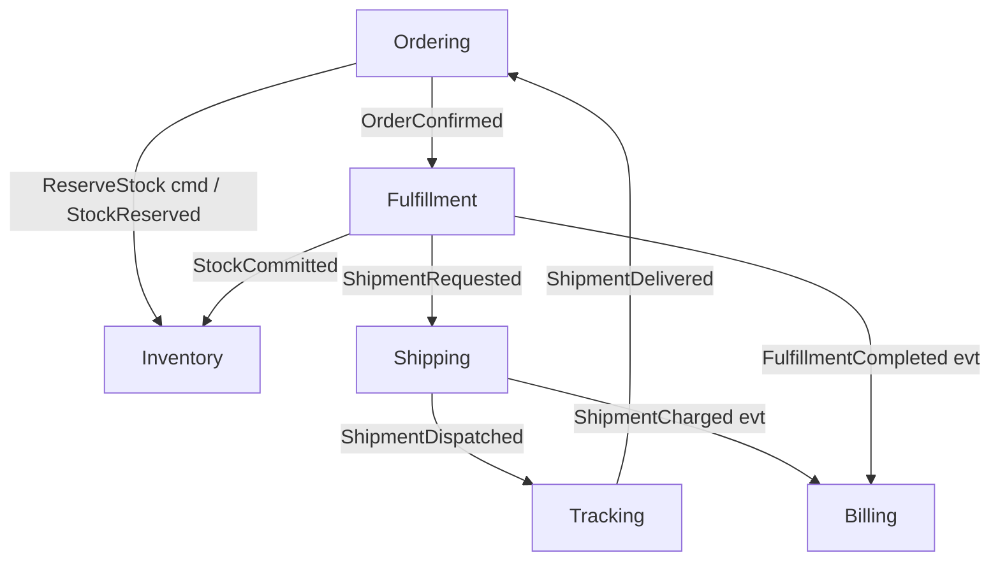

# Throughline — Domain Charter

> The stable, canonical description of the practice domain. **Every user story and review
> references this file.** Keep the world coherent: reuse these bounded contexts, aggregates,
> and ubiquitous language across all stories rather than inventing new ones.

- **Status:** Active
- **Added:** 2026-08-02
- **Updated:** 2026-08-02

---

## 1. Product identity

**Throughline is a fulfillment & shipping orchestration platform — a "3PL operating system."**

Merchants (Throughline's customers) sell on their own channels and hand their orders to
Throughline. Throughline picks and packs those orders from its own warehouses, rate-shops
across multiple carriers to buy the cheapest suitable shipping label, tracks each parcel to
the doorstep, and bills the merchant for storage, pick/pack labor, and postage.

**One sentence:** *Merchants sell; Throughline fulfills and ships on their behalf, at high
volume, across many carriers and warehouses.*

### What it's an example of
- **Product category:** a **3PL / order-fulfillment platform** — a hybrid **WMS**
  (Warehouse Management System) + **TMS** (Transportation Management System) with a
  **multi-carrier shipping** layer.
- **Architecture class:** a **multi-tenant B2B SaaS orchestration system**, whose core job
  is coordinating long-running, failure-prone workflows across independent subsystems.
- **Real-world analogues:** ShipBob, Deliverr, Amazon Multi-Channel Fulfillment (fulfillment
  side); EasyPost, Shippo (multi-carrier shipping layer); Flexport, Project44 (freight
  visibility).

### Why this domain (design intent)
The load-bearing reason Throughline exists as a teaching vehicle: an
**order → shipment → charge** flow spans four modules that **must never be updated in one
transaction**. That single constraint honestly forces the outbox pattern, sagas, integration
events, idempotency, and eventual consistency — the staff-bar skills on the backlog. A
simpler domain cannot manufacture that pressure without contrivance.

---

## 2. Solution & naming conventions

- **Namespace root / solution:** `Throughline`
- **Repo home:** the `api-lab` repo; the solution lives under `api-lab/src/Throughline/`.
- **Project naming:** `Throughline.Modules.<Context>.<Layer>` (e.g.
  `Throughline.Modules.Ordering.Domain`), shared plumbing under `Throughline.Shared.*`,
  the single host is `Throughline.Api`.
- **Reference topology:** Kamil Grzybek's `modular-monolith-with-ddd` (the one verified true
  modular-monolith reference). Amendments adopted for this lab:
  1. Shared technical plumbing folder is named **`Shared`**, not `BuildingBlocks`
     (following current `dotnet/eShop`; avoid `SharedKernel`, which means shared *domain*).
  2. **Right-size per module** — the four-layer stack (Domain/Application/Infrastructure/
     IntegrationEvents) is the default for complex contexts, **not** a mandate for all six.
     A thin read-model context may be a single project. Each story must justify its choice.
  3. **Two entry points per module:** a synchronous facade interface `I<Context>Module`
     (command-with-result / command-without-result / query) **and** an asynchronous
     `IntegrationEvents` contract. These are the *only* things other modules may reference.

---

## 3. Bounded contexts (the module map)

Six bounded contexts. Each owns its own data (schema-per-module); **no shared tables, no
cross-context foreign keys, no cross-context joins.**

| Context | Responsibility | Key aggregates | Core invariants |
|---|---|---|---|
| **Ordering** | Accept & validate merchant orders; request stock allocation; drive the order lifecycle. | `Order` (root), `OrderLine` | An order can't be confirmed unless every line is allocated; a confirmed order is immutable except via defined transitions. |
| **Inventory** | Track on-hand / reserved / available stock per SKU per warehouse; reserve then commit stock. | `StockItem` (SKU × warehouse), `Reservation` | Available = OnHand − Reserved; never reserve below zero; a reservation is idempotent per order. |
| **Fulfillment** (Warehouse) | Turn an allocated order into a physical shipment: pick, pack, weigh, produce a package. | `FulfillmentOrder` (root), `Pick`, `Package` | Can't pack what wasn't picked; a fulfillment order maps to exactly one shipment request. |
| **Shipping** (Carrier) | Rate-shop across carriers, purchase a label, hand the parcel to the carrier. | `Shipment` (root), `RateQuote`, `Label` | A shipment has exactly one purchased label; label purchase is idempotent (never buy twice for the same shipment). |
| **Tracking** | Ingest carrier scan events; expose current delivery status; detect exceptions. | `TrackedShipment` (read-model root), `ScanEvent` | Status transitions are monotonic per the carrier's lifecycle; duplicate/out-of-order scans are idempotent. |
| **Billing** | Meter and charge merchants for storage, pick/pack, and postage; issue invoices. | `MerchantAccount`, `Invoice`, `Charge` | A given fulfillment/shipment is billed **at most once**; charges are append-only and reconcilable. |

### Context map (relationships)

- **Ordering** is upstream of everything; it kicks off the flow.
- **Inventory** is a shared supplier to Ordering and Fulfillment — a **Customer/Supplier**
  relationship (they conform to Inventory's contract).
- **Shipping** wraps flaky external carrier APIs behind an **Anti-Corruption Layer**; the
  rest of the system never sees a raw carrier response.
- **Tracking** and **Billing** are downstream, eventually-consistent consumers.

---

## 4. The three flows that generate the hard problems

### Flow A — Order intake & allocation (Ordering ↔ Inventory)
Merchant submits an order (often **with retries** → must be idempotent). Ordering asks
Inventory to reserve stock. If any line can't be reserved, the order is held/backordered.
**Forces:** idempotent intake, optimistic concurrency on stock, reserve-vs-commit semantics.

### Flow B — Fulfill & ship (Ordering → Fulfillment → Inventory → Shipping → Tracking)
On confirmation, a fulfillment order is created; warehouse picks/packs; reserved stock is
**committed** (decremented); a shipment is requested; Shipping rate-shops and buys a label;
the parcel dispatches; Tracking begins ingesting scans.
**Forces:** a multi-step **saga** across modules, domain events, ACL over carrier APIs,
retries/timeouts on external calls, out-of-order & idempotent scan ingestion.

### Flow C — Charge the merchant (Fulfillment + Shipping → Billing)
Fulfillment labor and postage must be billed **exactly once**, even though Billing lives in a
separate module updated in a **separate transaction** from where the work happened.
**Forces:** the **outbox pattern**, integration events, and idempotency keys so a retried or
duplicated event **never double-charges**. This is the flagship scenario of the whole lab.

---

## 5. Ubiquitous language (glossary)

Keep these terms exact and consistent across stories. Same word, same meaning, everywhere.

| Term | Meaning |
|---|---|
| **Merchant** | Throughline's paying customer; the tenant who owns orders and stock. |
| **Order** | A merchant's request to ship goods to an end customer. |
| **SKU** | Stock-keeping unit; a sellable product identity. |
| **On-hand** | Physical stock present in a warehouse. |
| **Reserved** | Stock earmarked for an order but not yet shipped. |
| **Available** | On-hand minus Reserved; what can still be promised. |
| **Allocation** | The act of reserving stock for an order's lines. |
| **Fulfillment Order** | The warehouse's work order to pick/pack one order. |
| **Pick** | Retrieving items from shelves for a fulfillment order. |
| **Package** | A packed, weighed unit ready to ship. |
| **Shipment** | A package handed to a carrier under one label. |
| **Rate-shop** | Querying carriers for prices/service levels to pick the best. |
| **Label** | The purchased carrier shipping label for a shipment. |
| **Carrier** | External delivery company (e.g. UPS/FedEx analogue). |
| **Scan / Scan Event** | A carrier status update for a tracked shipment. |
| **Exception** | A delivery problem (lost, delayed, address issue). |
| **Charge** | A billable line against a merchant (storage / pick-pack / postage). |
| **Invoice** | A periodic statement aggregating a merchant's charges. |

---

## 6. Non-functional context (the "high-volume" framing)

Assume Throughline operates at logistics scale, and let stories dial these up as needed:

- **Volume:** millions of orders/day at peak (seasonal spikes — a "Black Friday" analogue).
- **Retries everywhere:** clients and carriers retry; **every write path must tolerate
  duplication** without corrupting state or double-charging.
- **Partial failure is normal:** carrier APIs time out, warehouses go offline; the system
  degrades and recovers rather than losing work.
- **Eventual consistency is expected** across contexts; only within an aggregate is strong
  consistency assumed.
- **Auditability:** money movement (Billing) and stock movement (Inventory) must be
  reconstructable from an append-only history.

---

## 7. How stories use this charter

- A story picks **one target pattern/skill** and frames it inside one of these contexts (or a
  seam between two), reusing the aggregates and language above.
- Acceptance criteria reference the **invariants** and **flows** here rather than restating
  them.
- If a story needs a concept not in this charter, that's a signal to **extend the charter
  deliberately** (add the term/aggregate here first), not to invent a one-off.
